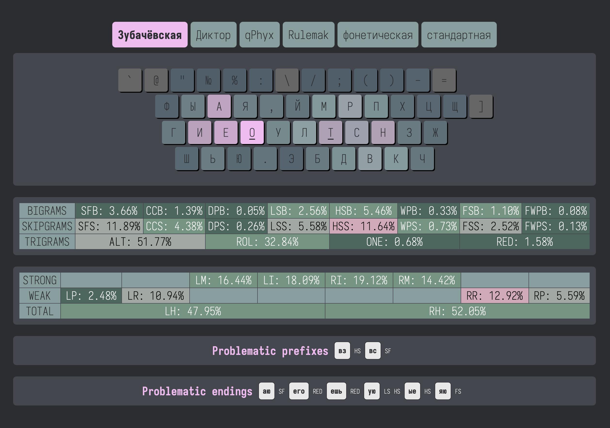

# KeySolve-ru

I have added some metrics so that [KeySolve](https://grassfedreeve.github.io/keysolve-web/) can be used to evaluate a selection of Russian keyboard layouts. The editing feature has been removed and the board style has been changed to US ANSI row-staggered only. (It was necessary to have rows of varying lengths and this did not work with the existing HTML/CSS/JS.)

Traditional touch-typing technique is assumed (that is, `ZXCV` are all struck with different left-hand fingers).

One big caveat is that the app does not provide for dead keys or layers. This would affect the stats slightly, but not significantly, for patterns containing `ё` and `ъ`, because non-standard layouts without them are assumed to have them on another layer. For example, both Диктор and Зубачёвская have `ъ` on a layer of `ь`.

A few of the layouts did not specify anything for the number row, and because Стандартная (that is, JCUKEN) doesn't even have unshifted punctuation, I had to specify the number row in such a way that the keys for digits (and not symbols) corresponded to their shifted version. For Диктор, I based it on [this updated Mac version](https://github.com/mshkrebtan/diktor), except since `!` is already available on the Shift layer of `.`, I put `@` there instead. I used those same assignments for Зубачёвская. For [qPhyx](https://github.com/uqqu/layout), I used the same key assignments as Стандартная, since it also does not have punctuation in the main rows.

I have also included a bunch of common prefixes and endings (or partial endings) that consist of 2 or 3 letters. Some word elements might be obscured in corpus data, but given that they are grammatical markers and independent of the lexicon, I think it is important to take them into account. For example, on the phonetic layout, `зa`, `aя`, and `ся` are extremely difficult to type, corresponding to QWERTY `za`, `aq`, and `sq`.

## How to Use

You can hover over any of the metrics to see the key combinations that pertain to them. They are colored similarly to the heatmap for the main layout, but I did not set the text color to change dynamically, so if they are hard to read (black on dark background), then that combination is not really worth worrying about.

## Metric Classes

**Bigrams**  
A bigram is a pattern of two letters that occur next to each other. All bigram metrics have the letter `B` at the end of their abbreviation.
- The word `the` has two bigrams: `th` and `he`.

**Skipgrams**  
A skipgram is a pattern of two letters that are separated by any other letter. All skipgram metrics have the letter `S` at the end of their abbreviation.
- The word `the` has only one skipgram: `te`.

**Trigrams**  
A trigram is a pattern of three letters that occur next to each other. 
- The word `the` has only one trigram: `the`.

## Bigram Types

**SF (Same Finger)**  
SFs are patterns that involve using the same finger twice to hit both letters. These sequences are generally very slow and should be minimized as much as possible.
- On QWERTY, `ed` is a very common SFB.

**DP (Center Column)**
*Added*: These are any index finger SFBs where one or both keys is in the center column. These are not deducted from the total SFB count.
- On QWERTY, `rt` and `ny` are examples of CCBs.

**DP (Double Pinky)**
*Added*: These are not deducted from the total SFB count.
- QWERTY has none, but on the standard Russian layout, `зж` corresponds to `p:`, which is a DPB.

**LS (Lateral Stretch)**  
Lateral stretches are patterns that involve reaches into the outer index column with the index followed or preceded by middle finger use.
- On QWERTY, `et`, `ct`, and 'eg` are all examples of LSBs.

*Added*: RH hand center column + pinky column and ring column + non-adjacent pinky column.

**HS (Half-Scissor)**  
A half-scissor is a pattern where one finger needs to stretch or contract to press a key on the top or bottom row and another finger on the same hand stays on the homerow - but the finger that is on the lower of the two rows is either middle or ring.
- `ok`, `sc`, and `rd` are common examples of half-scissors on QWERTY.

*Added*: LH index-middle combinations `fc` and `gc`, which don't occur in English (except compound words).

**WP (Winged Pinky)**
*Added*: This is a pattern where the ring finger hits a key and the pinky hits a key on the row above, or the pinky hits a key and the ring finger hits a key on the row below.
- `sq`, `ax`, and `pl` are all examples of winged-pinky patterns on QWERTY.

**FS (Full-Scissor)**  
A full-scissor is a pattern where one finger needs to reach to the top row and another finger on the same hand needs to contract to hit the bottom row - but the finger that is on the lower of two rows is either middle or ring.
- `cr`, `ex`, `xt` are all FSBs on QWERTY.

*Added*: LH index-middle combinations `rc` and `tc`.

**FWP (Full Winged Pinky)**
*Added*: This is a pattern where the ring finger hits a key and the pinky hits a key two or more rows above, or the pinky hits a key and the ring finger hits a key two or more rows below.

- `p.` is an example of this pattern on QWERTY.

## Trigram Types

**ALT (Alternation)**  
An alternation sequence is when hand use alternates over three consecutive keypresses - either Left-Right-Left or Right-Left-Right.

**ROL (Roll)**  
A roll is when one hand presses two keys consecutively and is followed or preceded by a keypress on the other hand - either Left-Left-Right, Left-Right-Right, Right-Left-Left, or Right-Right-Left.

**ONE (Onehand)**  
A onehand is when all three keypresses are pressed on the same hand, and in an order from left to right or right to left.
- `asd`, `sdf`, and `fds` are all onehands on QWERTY.

**RED (Redirect)**  
A redirect is when all three keypresses are pressed on the same hand but don't occur in a smooth order.
- `sea`, `sca`, and `rse` are all redirects on QWERTY.
